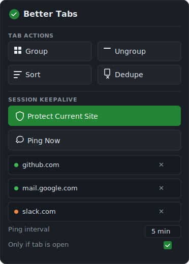

<p align="center">
  
</p>

# Better Tabs

Manage browser tabs and keep site sessions alive.

<p align="center">
  
</p>

## Install

Install from [Firefox Add-ons](https://addons.mozilla.org/en-US/firefox/addon/better-tabs1/).

### Local Development

1. Open `about:debugging#/runtime/this-firefox`
2. Click **Load Temporary Add-on**
3. Select `extension/manifest.json`

## Features

- **Group by Domain** — Organize tabs into groups by website
- **Ungroup All** — Remove all tab groups
- **Sort Alphabetically** — Sort tabs by URL
- **Close Duplicates** — Remove duplicate tabs
- **Session Keepalive** — Periodically ping protected sites to keep you logged in

## Tests

```bash
npm test
```
