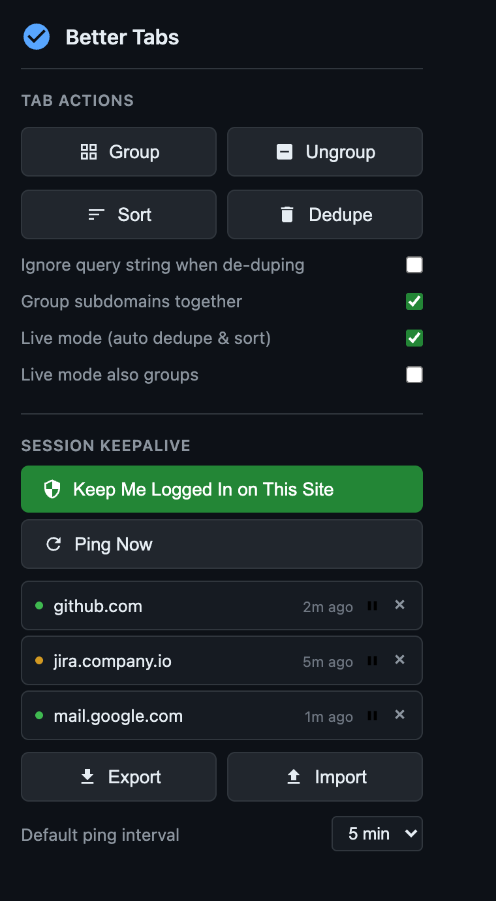

# Better Tabs

Manage browser tabs and keep site sessions alive.

<p align="center">
  
</p>

<p align="center">
  
</p>

## Features

- **Group by Domain** (Alt+Shift+G) - Organize tabs into groups by website, optionally merging subdomains; single tabs stay ungrouped
- **Ungroup All** - Remove all tab groups
- **Sort** (Alt+Shift+S) - Sort tabs by site and title; groups stay intact on top, loose tabs sorted below
- **Close Duplicates** (Alt+Shift+D) - Remove duplicate tabs with one-click undo; can ignore query strings, never closes pinned or audible tabs
- **Live Mode** - Automatically dedupe, sort, and optionally group tabs as you browse
- **Session Keepalive** - Ping protected sites in the background so you stay logged in, with per-site ping intervals and URLs ([how it works](docs/how-it-works.md))
- **Logout Alerts** - Get notified when a ping fails or lands on a login page, before you lose work
- **Export / Import** - Back up the protected site list or move it to another browser
- **Sync** - The site list follows your Firefox account across machines

## Install

Install from [Firefox Add-ons](https://addons.mozilla.org/en-US/firefox/addon/better-tabs1/).

### Local Development

1. Open `about:debugging#/runtime/this-firefox`
2. Click **Load Temporary Add-on**
3. Select `extension/manifest.json`

## Tests

```bash
npm test
```
